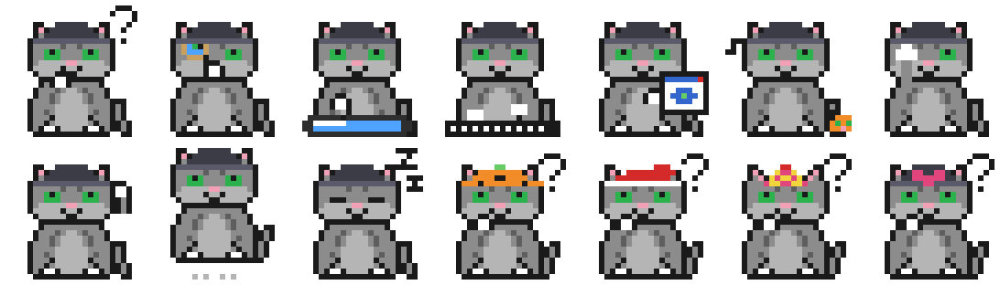

# Mascot Studio

A 2000s animation studio inside your Claude Code terminal. While Claude works, **Mascot Programming**, a pixel-art grey tabby in a beanie, acts out each step on the Stage:
- It reads files through a magnifier.
- It draws on a pen tablet while editing.
- It types away at the shell.
- It facepalms when a command fails.

Each tool call becomes a keyframe on the timeline. Between turns the cat checks your Claude usage in a period Task Manager. A DJ blob in the MascotAmp panel dances to whatever music is playing.



## Install

```
claude plugin marketplace add clockendbader/mascot-studio
claude plugin install mascot-studio@mascot-studio
```

That's it. With **Open on startup** on (the default), the studio docks beside the conversation every time Claude Code starts, in the fullscreen terminal layout at 144+ columns. Anywhere else, type `/studio` to open it, and type `/studio` again to close it.

Mascot Studio is terminal-only for now.

## What's in the pane

| Part | What it shows |
|---|---|
| **Timeline** | One `●` keyframe per tool call (`✖` when it failed) on the Cat layer, and one on the Sound layer per track change. The red `▼` is the playhead. Click a keyframe to inspect it. |
| **Stage, Scene 1** | The mascot's current pose: thinking, magnifier, pen tablet, keyboard, tiny browser, calling a helper, facepalm, waving, the "Export Movie" hop, asleep. |
| **Stage, Scene 2** | Task Manager, with live meters for context, the 5-hour and weekly plan limits, and the session cost. A mini cat climbs the history graph and sweats as usage rises. |
| **Properties** | The live tool and its target, or the keyframe you pinned. |
| **MascotAmp** | Now playing, a scrolling LCD title, a (decorative) spectrum, and transport controls. |

Extras:
- **Error dialogs:** an error box pops up when a tool fails.
- **"Needs you" alert:** an instant-message window, and a line under the prompt, when Claude is waiting for your permission or answer.
- **Screensavers:** pipes, a starfield, and flying cats with toast wings, after a few idle minutes.
- **Hit counter:** a lifetime count of tool calls ("visitor #000427").
- **Holiday hats:** a pumpkin in October, a Santa hat in December, and others.

### Hotkeys

These work while the pane has focus. Click it, or press ctrl+x then tab.

| Key | Action |
|---|---|
| `t` | Switch Scene 1 / Scene 2 |
| `l` | Back to live (after inspecting a keyframe) |
| `b` / `p` / `n` | Previous / play-pause / next track |
| `r` | Retry a stopped sound helper |

## Settings

Change these in `/config`:

| Setting | Default | Effect |
|---|---|---|
| Open on startup | on | Open the studio when a session starts. |
| Sound panel | on | Off runs no helper process and reads no media. |
| Screensaver minutes | 5 | Idle minutes before the screensaver; `0` turns it off. |

## Music on each system

| System | How it connects |
|---|---|
| **Windows** | Works out of the box, through the system media session (Spotify, browsers, the Media Player app, and so on). |
| **Linux** | Needs `playerctl`, e.g. `sudo apt install playerctl` (or your distro's package). Works with any MPRIS player. |
| **macOS** | Music and Spotify, through AppleScript. The first time, macOS asks to let your terminal control them; if you said no, allow it in System Settings › Privacy & Security › Automation. |

Mascot Studio has been tested on Windows. The macOS and Linux sound code is covered by automated tests only. **Testers on those systems are very welcome:** please open an issue with what you see.

## About the look

Mascot Studio pays homage to early-2000s design tools and desktop software. It uses its own names ("Mascot Studio MX", "Task Manager", "MascotAmp"), and all pixel art is original. It uses no third-party logos, icons, or sounds.

## Development

```
claude plugin test plugins/mascot-studio        # 198 tests
claude plugin validate plugins/mascot-studio
claude --plugin-dir plugins/mascot-studio        # run it from this folder
```

The design spec and implementation plan are in [`docs/superpowers`](docs/superpowers).

## License

MIT
