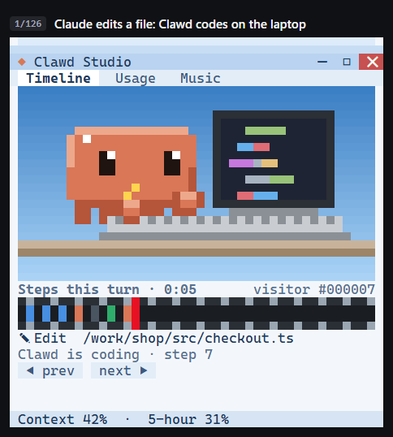
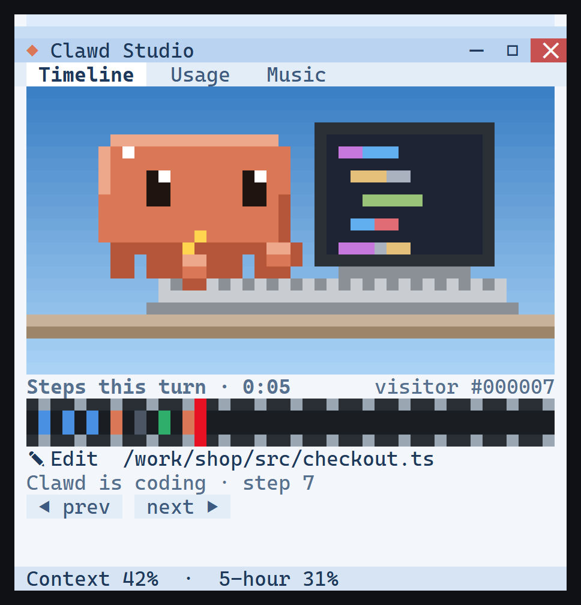
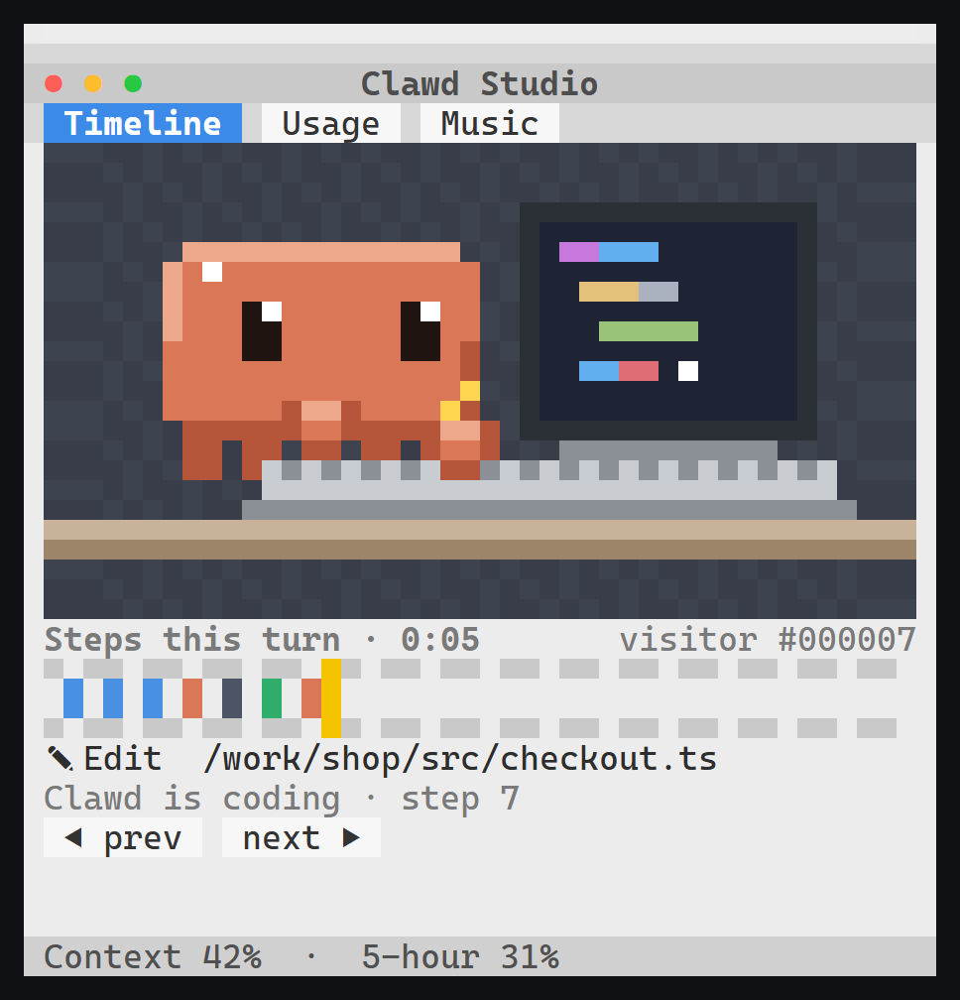
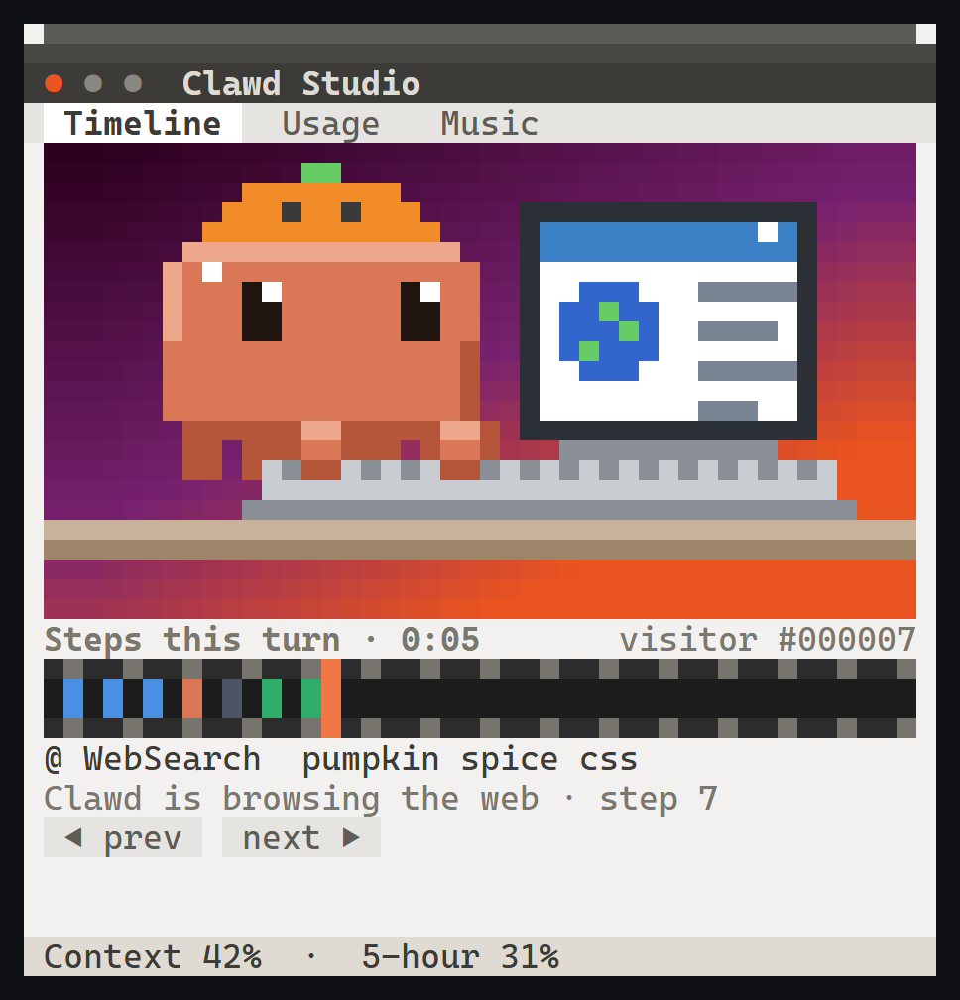

# Clawd Studio

A 2010s-style animation studio inside your Claude Code terminal. While Claude works, **Clawd** sits at a laptop on the Stage and acts out every step: typing when Claude edits, reading when it reads, scratching its head while it thinks, facepalming when a command fails, and waving when Claude needs your OK.



> **Unofficial fan project.** Clawd Studio is not made, endorsed or supported by Anthropic. Claude and Claude Code are Anthropic's; the Clawd pixel art here is an original fan drawing, and no Anthropic logos are used.

## Install

You need [Claude Code](https://github.com/anthropics/claude-code) (built and tested with 2.1.289). Add this repo as a plugin marketplace, then install the plugin:

```
claude plugin marketplace add clockendbader/mascot-studio
claude plugin install mascot-studio@mascot-studio
```

Then start (or restart) Claude Code.

- With **Open on startup** on (the default), the studio docks beside the conversation by itself when there is room: Claude Code's fullscreen layout and a terminal at least 144 columns wide.
- Otherwise, type **`/studio`** to open it, and `/studio` again to close it.

Clicking works in Claude Code's fullscreen layout. Set `"tui": "fullscreen"` in your Claude Code settings if you don't use it already. On the classic screen the terminal doesn't report clicks, so use the `/studio` commands below instead.

## What you see

| Part | What it shows |
|---|---|
| **Title bar and tabs** | The window chrome of your theme. Click **Timeline**, **Usage** or **Music** to switch tabs. |
| **Stage** | Clawd at the laptop, acting out what Claude is doing (see the poses below). |
| **Timeline tab** | A film strip with one clip per tool call this turn, coloured by kind: blue reading, orange editing, grey terminal, green web, purple helper, red failed. Below it is the live step: the tool and its target, and "Clawd is coding · step 7". Click a clip to pin and inspect that step: its tool, target, ✓ or ✖ and how long it took. **◀ prev**, **next ▶** and **Back to live** move around. |
| **Usage tab** | Bars for **context**, the **5-hour** and **weekly** plan limits (amber from 80%, red from 95%), with reset times. Below them are the estimated cost, turns and tool calls, and a graph of context use, one point per turn. **details ▸** swaps the graph for token counts and reset dates. On an API key it says "No plan limits (API key)". |
| **Music tab** | What's playing on your computer, with a dancing DJ blob, a live progress bar, and **◀◀ ❚❚ ▶▶** buttons. |
| **Status bar** | Context %, 5-hour % and the current song. Click one to jump to its tab. |

### Clawd's poses

| Claude is… | Clawd… |
|---|---|
| reading files, searching | reads a document on the laptop |
| editing or writing files | types code |
| running a shell command | types into a terminal |
| fetching or searching the web | browses a web page |
| calling a helper agent | gets a mini Clawd popping out of the laptop to help |
| between steps | thinks and scratches its head |
| failing a tool call | facepalms, with an error box over the Stage |
| waiting for your permission or answer | waves you over, with a chat on the screen and an instant-message window |
| done with the turn | hops with its arms up beside a big ✓, then rests |
| idle for a minute | falls asleep (Zzz) |

Extras:
- **Error box.** It closes when you click **OK**, when the next tool call starts, or after 8 seconds.
- **Waiting on you.** Claude Code's status line also reads "Clawd is waiting on you". When usage gets high it shows a warning instead, such as "Clawd: context 84% · consider /compact".
- **Screensavers.** After a few idle minutes the Stage shows pipes, a starfield or flying Clawds with toast wings. Any activity wakes it.
- **Hit counter.** A lifetime count of tool calls ("visitor #000427").
- **Holiday hats.** A pumpkin all October, a Santa hat all December, a party hat on New Year's Day, and a heart on Valentine's Day.

## Themes

Three 2010s desktops. **auto** (the default) matches your computer: Windows 7 on Windows, Mac OS X on macOS, Ubuntu on Linux.

| Windows 7 | Mac OS X | Ubuntu |
|---|---|---|
|  |  |  |

There are two ways to pick a theme:
- **Theme** in the plugin's options (see [Settings](#settings)) sets it from then on.
- `/studio theme windows7`, `/studio theme macos` or `/studio theme ubuntu` sets it for this session only.

## Commands

Everything you can click also has a command:

| Command | Does |
|---|---|
| `/studio` | Open or close the studio |
| `/studio timeline`, `/studio usage`, `/studio music` | Show that tab (opening the studio if needed) |
| `/studio prev`, `/studio next`, `/studio live` | Step through the timeline, or go back to live |
| `/studio details` | Swap the usage graph and the usage details |
| `/studio play`, `/studio back`, `/studio skip` | Play/pause, previous track, next track |
| `/studio retry` | Reconnect to music after the helper stopped |
| `/studio theme <windows7 \| macos \| ubuntu>` | Change the theme for this session |

After you click a row of buttons, its keys work too, until you press Esc:

| Row | Keys |
|---|---|
| Tabs | `1` Timeline, `2` Usage, `3` Music |
| Timeline buttons | `a` prev, `d` next, `l` back to live |
| Usage | `i` details |
| Music | `b` back, `p` play/pause, `n` skip, `r` retry |
| Error box | `o` OK |

## Settings

Run `/plugin configure mascot-studio@mascot-studio` in Claude Code. You can also open `/plugin`, pick mascot-studio, and choose **Configure options**. From a shell, use `claude plugin configure mascot-studio@mascot-studio`.

| Option | Default | Effect |
|---|---|---|
| Open on startup | on | Open the studio when a session starts |
| Music tab | on | Off runs no helper process and reads no media |
| Screensaver minutes | 5 | Idle minutes before the screensaver; `0` turns it off |
| Theme | auto | `auto`, `windows7`, `macos` or `ubuntu` |

Options apply when the plugin next loads. Restart Claude Code if you don't see a change.

## Music on each system

The Music tab reads what's already playing on your computer. It never plays anything itself.

| System | How it connects |
|---|---|
| **Windows** | Works out of the box through the system media controls: Spotify, browsers, the Media Player app, and so on. |
| **Linux** | Needs `playerctl` (for example `sudo apt install playerctl`). Works with any MPRIS player. |
| **macOS** | Music and Spotify, through AppleScript. The first time, macOS asks whether your terminal may control them. If you said no, allow it in System Settings › Privacy & Security › Automation. |

## Privacy

- Clawd Studio makes no network requests.
- It stores one number on your machine: the hit counter's lifetime total.
- It reads Claude's usage figures from Claude Code itself.
- When the Music tab is on, it asks your OS what's playing. It uses PowerShell on Windows, `playerctl` on Linux, and `pgrep` with `osascript` on macOS. Those processes run with fixed arguments, and nothing you type is passed to them.

## Tested on

- **Windows 11:** tested hands-on, including the music helper with Spotify and Chrome.
- **Windows, macOS and Linux:** every push runs [CI](.github/workflows/ci.yml) on GitHub's runners. Each run:
  1. Validates the plugin and runs its test suite.
  2. Runs a smoke check that drives that system's real music backend for 12 seconds and accepts only states the Music tab can show.
  3. On Linux, runs the smoke check both without and with `playerctl`.
  4. On macOS, also compiles the Music AppleScripts.

Reports from macOS and Linux users are very welcome: please open an issue.

## Development

```
claude plugin test plugins/mascot-studio         # the test suite
claude plugin validate plugins/mascot-studio     # what the engine would refuse
claude --plugin-dir plugins/mascot-studio        # run Claude Code with this checkout
npm run smoke                                    # this OS's real music backend, 12 s
bash scripts/make-demo.sh                        # re-record docs/media (needs python 3, ffmpeg, Edge or Chrome)
```

The plugin is plain TypeScript with no dependencies, using Claude Code's plugin hooks API:
- `hooks/register.tsx` wires the events.
- The pure modules under `hooks/` draw the art, the views and the music backends.
- `hooks/client/` holds the clickable rows and the film strip.

The design specs and implementation plans are in [`docs/superpowers`](docs/superpowers).

## License

[MIT](LICENSE) © 2026 clockendbader
